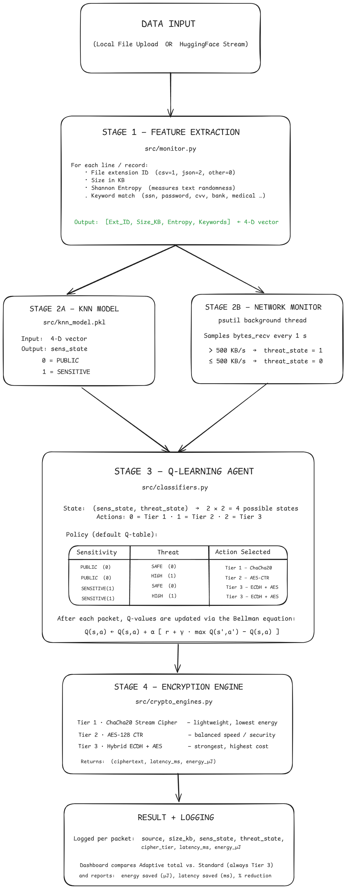

# Adaptive Cryptography Framework 🔐

An intelligent, multi-tier cryptographic routing engine that dynamically selects the right encryption cipher for every data packet based on two real-time signals — **data sensitivity** (classified by a Logistic Regression model) and **live network threat level** (monitored by a psutil background thread). A Q-Learning reinforcement agent makes the final cipher decision and continuously improves its policy through rewards.

---

## Key Results

| Scenario | Latency Reduction | Energy Savings |
|----------|:-----------------:|:--------------:|
| Local file (1,200 packets) | **61.99%** | **65.94%** |
| HuggingFace live stream (200 packets) | **68.50%** | — |

---

## How the Pipeline Works



---

## Project Structure

The repository is organized into three top-level categories:

```
adaptive_crypto_framework/
│
├── Documents/                     # Reports, context docs, and figures
│   ├── dataset_summary.md
│   ├── COLLABORATOR_AI_CONTEXT.md
│   ├── NOTEBOOKLM_PROJECT_SOURCE.md
│   └── images/
│
├── Model_Experimenting/           # Training, validation, and benchmarks
│   ├── notebooks/                 # Jupyter narrative (preprocessing, KNN, Q-Learning)
│   ├── data/                      # Raw + processed CSV datasets
│   ├── results/                   # LOFO validation outputs
│   ├── rebuild_sensitivity_dataset.py
│   ├── compare_classifiers_lofo.py
│   ├── leave_one_file_out_validation.py
│   ├── run_benchmarks.py
│   └── dashboards/                # Offline chart generators
│
├── Production/                    # Live demo and runtime code
│   ├── src/
│   │   ├── monitor.py             # Feature extraction (14-D vector)
│   │   ├── classifiers.py         # Q-Learning agent + reward function
│   │   ├── crypto_engines.py      # ChaCha20, AES-CTR, ECDH+AES
│   │   └── sensitivity_model.pkl  # Production Logistic Regression model
│   ├── templates/dashboard.html
│   ├── static/                    # CSS, JS, data-flow diagram
│   ├── run_live_web_dashboard.py  # Main Flask app
│   └── test_production_streams.py # Scapy-based test harness
│
├── repo_paths.py                  # Shared path constants for all scripts
├── Dockerfile
├── docker-compose.yml
├── requirements.txt
└── README.md
```

---

## Running Locally with Docker

### Prerequisites
- [Docker Desktop](https://www.docker.com/products/docker-desktop/) installed and running

### 1. Clone the repository

```bash
git clone https://github.com/parampatel885/adaptive_crypto_framework.git
cd adaptive_crypto_framework
```

### 2. Build and start the container

```bash
docker compose up --build
```

Expected output:
```
✅ Sensitivity model loaded from Production/src/sensitivity_model.pkl
📡 psutil network monitor active (threshold: 500 KB/s)…
🚀 Dashboard running at http://127.0.0.1:5000
```

### 3. Open the dashboard

Navigate to **http://localhost:5000** in your browser.

### 4. Run a test

**Option A — Local File:**
1. Click the **📁 Local File** tab
2. Upload any `.txt`, `.csv`, or `.json` file (up to 1,000 lines)
3. Click **🤖 Run Adaptive Encryption**
4. Click **🔒 Run Standard Encryption**
5. Click **📊 Compare Results**

**Option B — HuggingFace Dataset:**
1. Click the **🤗 HuggingFace Dataset** tab
2. Enter a dataset name (default: `ai4privacy/pii-masking-300k`)
3. Set how many records to stream (1–1,000)
4. Run both pipelines and compare

### 5. Stop the container

```bash
docker compose down
```

### Rebuild after code changes

```bash
docker compose up --build --force-recreate
```

---

## Running Locally without Docker

```bash
pip install -r requirements.txt
python Production/run_live_web_dashboard.py
```

Then open **http://127.0.0.1:5000**.

---

## Model Experimenting

Retrain the production classifier and rebuild the processed dataset:

```bash
python Model_Experimenting/rebuild_sensitivity_dataset.py --rows-per-file 200
```

Compare classifiers under leave-one-file-out validation:

```bash
python Model_Experimenting/compare_classifiers_lofo.py --rows-per-file 200
```

Run offline crypto benchmarks:

```bash
python Model_Experimenting/run_benchmarks.py
```

---

## Network Threat Detection

The dashboard runs a background thread using `psutil` that samples inbound network bytes every second. If traffic exceeds **500 KB/s**, the threat state flips to `HIGH` and the Q-Learning agent automatically escalates cipher selection to Tier 2 or Tier 3. The live threat status is pushed to the browser instantly via **Server-Sent Events (SSE)** — no polling required.

To adjust the sensitivity threshold, change this constant in `Production/run_live_web_dashboard.py`:

```python
_THREAT_THRESHOLD_BYTES: int = 500_000   # bytes per second
```

---

## Dependencies

| Package | Purpose |
|---------|---------|
| `flask` | Web server and SSE streaming |
| `scikit-learn` | Sensitivity classifier |
| `pandas` / `numpy` | Feature vector construction |
| `cryptography` | ChaCha20, AES-CTR, ECDH+AES implementations |
| `datasets` | HuggingFace dataset streaming |
| `psutil` | Live network throughput monitoring |
| `matplotlib` | Benchmark chart generation |
